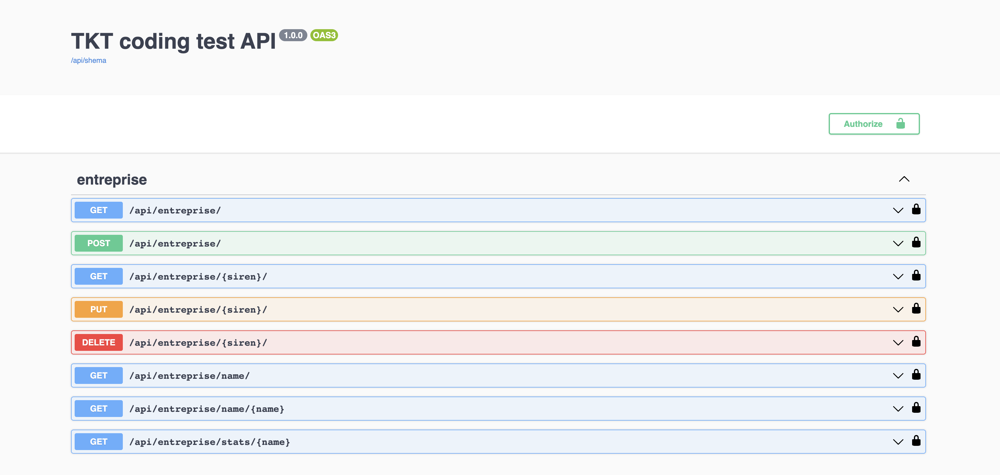

# TKT backend coding test

This project is a backend RESTful API service for a technical coding test at TKT.

## Project Description

The project is backend application that uses [Django REST Framework](https://www.django-rest-framework.org/), [PostgreSQL](https://www.postgresql.org/) to serve APIs.

The APIs serve data about entreprises and there details and stats.

To simulate and test the project, data samples were provided in a JSON file named **initial_data.json**.

## Data

The provided JSON file consists of 1000 entries. Data are fictitious not real. There are no null values and each entry can be like the following example:

```
{"name":"Reinger Inc","sector":"Services","siren":135694027,"results":[{"ca":2077357,"margin":497351,"ebitda":65952,"loss":858474,"year":2017},{"ca":432070,"margin":427778,"ebitda":290433,"loss":8023406,"year":2016}]}
```

The schema used in the poject follows the same stracture of the JSON file while respecting some constraints. The database schema contains two tables Entreprise and Result. An Entreprise instance can have multiple Results instances.
Here are the constraints about data fields:

  - Each entreprise have a unique SIREN number containing exactly 9 digits

  - An entreprise must not have duplicate years.

  - Users can't add future years. Only years from 1980 until the current year can be added.

  - There 5 unique sectors in the whole dataset but 6 in the project database (Services, Electronic, Energy, Luxury, Retail or Other). The choice "Other" can be used for other sectors.

## APIs

The project API services are :

- get all the existing entreprises or post a new one to the database

```bash
  http://localhost:8000/api/entreprise/  
```

- get, put(update), or delete an entreprise using its SIREN number

```bash
  http://localhost:8000/api/entreprise/135694027/
```

- get all entreprises names

```bash
  http://localhost:8000/api/entreprise/name/
```

- get all entreprise details by name

```bash
  http://localhost:8000/api/entreprise/name/Reinger%20Inc
```


- get all entreprise results comparaison by name. The comparaison is done on each year with its previous. 

```bash
  http://localhost:8000/api/entreprise/stats/McKenzie%20LLC
```

## Getting started

- To run the project you must have [docker](https://www.docker.com/) installed

- First clone the project then open a terminal in the folder project

```bash
git clone https://github.com/y05f/tkt_backend.git
cd lokimo_backend
```

- Start docker then build the image and run the container:

```bash
docker-compose up -d --build
```

- Open [http://localhost:8000/api](http://localhost:8000/api) and you will see the django rest framework API documentations using swagger-ui.
  

## Initialize data
To initialize data with the given samples from JSON file type :

```bash
docker-compose exec web  python manage.py resetdata
```

This will delete all existing data and insert raw data from the json file **initial_data.json** to project's database.

The script behind this command is located in the management folder in entreprises folder.

## Runing tests

- To run tests just type :

```bash
docker-compose exec web  python manage.py test
```

The testing phasse consists of 6 tests of all the endpoints where the file **test_data.json** is used as testing database.

## How to read and explore the project

The project folder contains 3 main folders (entreprises, api, tkt_project). If you want to explore the code behind the project check the following files :

- The **tkt_project** folder is the main django folder project.

- The **entreprises** folder is a django app which contains the entreprise **models** and **script to reset data** using **initial_data.json**

- The **api** folder contains the **serilizers**, the **views** and **urls** plus the **test units**.


## License

[MIT](https://choosealicense.com/licenses/mit/)

## Credits

- Django official doc [https://docs.djangoproject.com/en/4.1/howto/](https://docs.djangoproject.com/en/4.1/howto/)

- Django REST framework official doc [https://www.django-rest-framework.org/](https://www.django-rest-framework.org/)

- drf-spectacular official doc [https://drf-spectacular.readthedocs.io/en/latest/readme.html#take-it-for-a-spin](https://drf-spectacular.readthedocs.io/en/latest/readme.html#take-it-for-a-spin)
